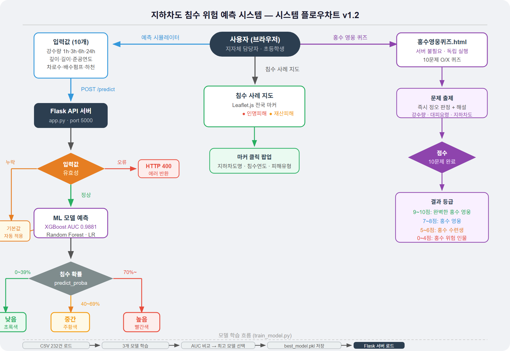

# 지하차도 침수 위험 예측 시스템

머신러닝(Random Forest / XGBoost)을 활용하여 강수량과 지하차도 특성 정보를 기반으로 침수 위험도를 예측하는 시스템입니다.

## 주요 기능

- 시간별·누적 강수량 입력 → 실시간 침수 위험도 예측
- Leaflet.js 기반 전국 지하차도 침수 사례 지도 시각화 → [시뮬레이터 바로가기 🗺️](https://seonghwanaa.github.io/Weather_ML/시뮬레이터.html)
- 위험도 3단계 표시 (낮음 / 중간 / 높음)
- **홍수 영웅 퀴즈** — 초등학생 대상 O/X 퀴즈 게임 (10문제) → [바로 플레이하기 🎮](https://seonghwanaa.github.io/Weather_ML/홍수영웅퀴즈.html)

## 시스템 플로우차트

[](https://www.figma.com/board/711K35nd0soK335KpeVYrK)

## 기술 스택

| 구분 | 기술 |
|------|------|
| ML 모델 | Random Forest, XGBoost, Logistic Regression |
| 백엔드 | Python, Flask |
| 프론트엔드 | HTML5, JavaScript, Leaflet.js |
| 데이터 | 공공데이터포털 지하차도 현황 + Open-Meteo 실측 강수량 |

## 사용 피처

| 피처 | 설명 |
|------|------|
| rainfall_1h_mm | 시간당 강수량 (mm) |
| rainfall_3h_mm | 3시간 누적 강수량 (mm) |
| rainfall_6h_mm | 6시간 누적 강수량 (mm) |
| rainfall_24h_mm | 24시간 누적 강수량 (mm) |
| depth_m | 지하차도 깊이 (m) |
| length_m | 지하차도 길이 (m) |
| built_year | 준공연도 |
| lanes | 차로수 |
| has_drainage_pump | 배수펌프 유무 (0/1) |
| nearby_river | 하천 인접 여부 (0/1) |

## 모델 성능

| 모델 | CV AUC | Test AUC | Accuracy |
|------|--------|----------|----------|
| Logistic Regression | 0.9487 | 0.9857 | 91.5% |
| **Random Forest** | **0.9760** | **0.9857** | **93.6%** |
| XGBoost | 0.9674 | 0.9881 | 91.5% |

## 데이터 출처

- 전국 지하차도 현황: 공공데이터포털 (data.go.kr) — 13개 지자체 CSV
- 침수 사례: 언론보도, 나무위키, 서울시 침수흔적도
- 강수량: Open-Meteo ERA5 위성 재분석 실측 데이터

## 실행 방법

```bash
# 1. 패키지 설치
pip install -r requirements.txt

# 2. 모델 학습 (model/ 폴더 자동 생성)
python train_model.py

# 3. 서버 실행
python app.py

# 4. 브라우저에서 접속
# http://localhost:5000
```

## 폴더 구조

```
미니프로젝트/
├── app.py                      # Flask API 서버
├── train_model.py              # 모델 학습 스크립트
├── requirements.txt            # 패키지 목록
├── README.md
├── .gitignore
├── 시뮬레이터.html               # 침수 위험도 대시보드
├── 홍수영웅퀴즈.html             # 초등학생 O/X 퀴즈 게임
├── 플로우차트.png                # 시스템 플로우차트
├── 지하차도_침수예측_AI_기획안.pdf  # 프로젝트 기획안
├── SRS.docx                    # 소프트웨어 요구사항 명세서
├── data/
│   ├── 지하차도_ML_최종데이터.csv  # ML 학습용 최종 데이터
│   ├── 피해상황-침수상황.csv
│   ├── 행정안전부_침수흔적도.csv
│   ├── 국토교통부_시설물안전법 대상 지하차도 현황_20230930.csv
│   └── ...기타 지자체 지하차도 현황 CSV (13개)
├── model/                      # train_model.py 실행 후 자동 생성 (.gitignore 제외)
│   ├── best_model.pkl
│   ├── scaler.pkl
│   └── features.pkl
└── templates/
    └── index.html              # Flask 템플릿
```
